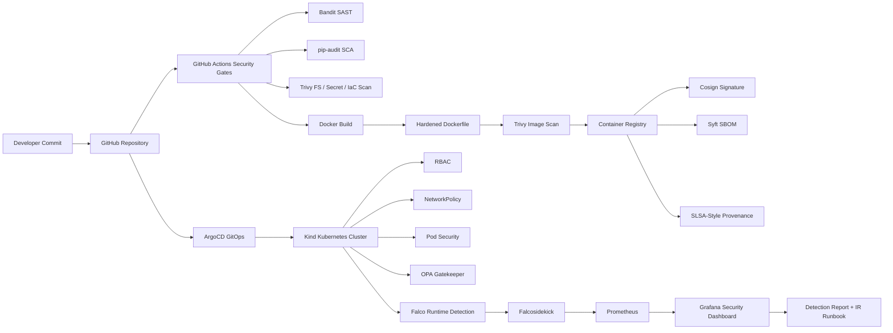
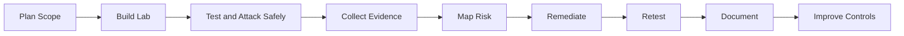

<p align="center">
  
</p>

<p align="center">
  
</p>

<p align="center">
  <a href="https://github.com/Jazz00001">
    
  </a>
  <a href="https://www.linkedin.com/in/jagriti-banerjee">
    
  </a>
  
</p>

<p align="center">
  
  
  
  
  
  
</p>

---

# Hi, I'm Jagriti Banerjee

I am a cybersecurity student and hands-on security lab builder focused on **enterprise-style security engineering**. My work connects offensive testing, defensive monitoring, DevSecOps, Kubernetes security, cloud security, detection engineering, evidence handling, and professional security reporting.

I build projects the way real security teams work:

```text
Find the weakness → prove it safely → document evidence → map impact
→ remediate or accept risk → retest → create professional reports
```

My goal is to grow into roles such as:

* SOC Analyst
* Detection Engineer
* DevSecOps Security Engineer
* Cloud Security Analyst
* Application Security / VAPT Analyst
* Kubernetes / Container Security Engineer
* Security Automation Engineer

---

## About Me

I focus on practical cybersecurity labs that simulate real enterprise environments. I do not only run tools; I build full security workflows with evidence, reporting, remediation, and validation.

My work includes:

* SOC analysis, alert triage, and incident documentation
* Wazuh SIEM/XDR monitoring and detection validation
* Windows endpoint security using Sysmon and Windows Event Logs
* MITRE ATT&CK mapping for security events and detections
* Web application VAPT and API security testing
* Active Directory attack simulation and internal security assessment
* AWS cloud security assessment and misconfiguration testing
* DevSecOps security with CI/CD security gates
* Docker hardening and container image security
* Kubernetes security using Kind, RBAC, NetworkPolicy, Pod Security, and policy-as-code
* Supply-chain security using Trivy, Syft SBOM, Cosign, SLSA-style provenance, and OpenSSF Scorecard
* Runtime detection using Falco, Falcosidekick, Prometheus, and Grafana
* Evidence-backed professional PDF reporting, retesting, and remediation documentation

---

## Current Focus

<p align="center">
  
</p>

```text
SOC Analysis
Detection Engineering
Wazuh SIEM/XDR
MITRE ATT&CK Mapping
Windows Endpoint Security
Web Application VAPT
API Security Testing
Active Directory Security
AWS Cloud Security
DevSecOps Security
CI/CD Security Gates
Docker and Container Security
Kubernetes Hardening
GitOps and ArgoCD
OPA Gatekeeper Policy-as-Code
Falco Runtime Detection
Prometheus and Grafana Security Observability
SBOM and Supply-Chain Security
Professional Security Reporting
```

---

## Featured Cybersecurity Projects

---

## 1. Enterprise Security Assessment Lab

**Web VAPT | API Security | Active Directory | AWS Cloud Security**

<p>
  <a href="https://github.com/Jazz00001/Enterprise-Security-Assessment-Lab">
    
  </a>
</p>

A full hands-on security assessment portfolio project covering multiple enterprise attack surfaces: web applications, APIs, internal Active Directory networks, and AWS cloud environments.

### Key Work Completed

* Built a structured Web VAPT lab using DVWA and Kali Linux
* Performed reconnaissance, enumeration, scanning, exploitation validation, and reporting
* Conducted API security testing using crAPI, Postman, JWT analysis, ffuf, Kiterunner, GraphQL, and OAuth request review
* Built an Active Directory attack lab with Responder, Hashcat, SMB validation, Kerberoasting, BloodHound, Pass-the-Hash, and DCSync testing
* Completed AWS cloud security assessment with IAM enumeration, Pacu, ScoutSuite, S3 access testing, IMDS credential exposure, cleanup, and billing verification
* Created professional PDF reports for assessment summaries, methodology sections, tool outputs, and evidence documentation
* Redacted sensitive values before GitHub publication

### Skills Demonstrated

`Web VAPT` · `API Security` · `Active Directory` · `AWS Security` · `Burp Suite` · `SQLMap` · `Postman` · `JWT` · `GraphQL` · `Responder` · `Hashcat` · `BloodHound` · `Impacket` · `Pacu` · `ScoutSuite` · `MITRE ATT&CK` · `Professional Reporting`

---

## 2. Enterprise DevSecOps Security Lab

**CI/CD Security | Docker Hardening | Kubernetes Security | GitOps | Supply Chain Security | Runtime Detection**

<p>
  <a href="https://github.com/Jazz00001/Enterprise-DevSecOps">
    
  </a>
</p>

This is my most advanced security engineering project. It is an end-to-end private Enterprise DevSecOps Security Lab that starts with a deliberately vulnerable Flask application and secures it through CI/CD security gates, Docker hardening, Kubernetes controls, GitOps, supply-chain security, runtime detection, observability, compliance mapping, and professional reporting.

The project is designed to show how modern security teams secure software from code commit to runtime.

### Project Flow



### Key Work Completed

* Built a vulnerable Flask application with intentional SQL injection, command injection, unsafe rendering, dependency vulnerability, and missing security header scenarios
* Created unit and security regression tests using pytest
* Added GitHub Actions security workflows for SAST, SCA, Trivy scanning, hardened container validation, and OpenSSF Scorecard evidence
* Built a professional `Dockerfile.hardened` with multi-stage build, non-root user, Gunicorn runtime, OCI labels, healthcheck, minimal copy scope, and Kubernetes compatibility
* Added `docker-compose.yml` for local app execution, security scanning, SBOM generation, and monitoring support
* Created a Kind-based Kubernetes lab with hardened manifests
* Implemented Kubernetes security controls including namespace isolation, ServiceAccount least privilege, RBAC, NetworkPolicy, SecurityContext, resource limits, probes, and restricted workload design
* Added OPA Gatekeeper policy-as-code validation for admission control
* Implemented ArgoCD GitOps with desired-state sync, drift detection, and self-healing demonstration
* Added supply-chain security with Syft SBOM, CycloneDX/SPDX outputs, Cosign signing evidence, image digest tracking, and SLSA-style provenance
* Added Falco runtime detection with Falcosidekick, Prometheus metrics, Grafana security dashboard, and alert rule documentation
* Created detection engineering reports with MITRE ATT&CK mapping, trigger conditions, severity, false positives, triage steps, response steps, and evidence screenshots
* Created a full professional documentation package including project summary, methodology, findings, remediation examples, retest proof, threat model, compliance mapping, risk register, audit summary, post-mortem, and evidence index

### Security Domains Covered

| Domain               | Implemented Evidence                                                                                          |
| -------------------- | ------------------------------------------------------------------------------------------------------------- |
| Application Security | SQLi, command injection, unsafe rendering, dependency findings                                                |
| Secure Code          | Remediation examples, security tests, retest proof                                                            |
| CI/CD Security       | GitHub Actions, security gates, OpenSSF Scorecard                                                             |
| Container Security   | Hardened Dockerfile, non-root image, Trivy scan                                                               |
| Kubernetes Security  | RBAC, NetworkPolicy, Pod Security, SecurityContext                                                            |
| GitOps               | ArgoCD sync, drift detection, self-healing                                                                    |
| Policy-as-Code       | OPA Gatekeeper admission control                                                                              |
| Supply Chain         | Syft SBOM, Cosign, image digest, SLSA-style provenance                                                        |
| Runtime Detection    | Falco, Falcosidekick, Prometheus, Grafana                                                                     |
| Compliance           | NIST SSDF, OWASP ASVS, CIS Kubernetes Benchmark, SLSA, SOC 2 style, ISO 27001 style, PCI/HIPAA alignment only |
| Reporting            | Professional PDFs, evidence screenshots, retest matrix                                                        |

### Skills Demonstrated

`DevSecOps` · `CI/CD Security` · `GitHub Actions` · `Flask` · `Python` · `Docker` · `Dockerfile Hardening` · `Kubernetes` · `Kind` · `ArgoCD` · `GitOps` · `RBAC` · `NetworkPolicy` · `Pod Security` · `OPA Gatekeeper` · `Trivy` · `Bandit` · `pip-audit` · `Syft` · `SBOM` · `Cosign` · `SLSA` · `OpenSSF Scorecard` · `Falco` · `Falcosidekick` · `Prometheus` · `Grafana` · `MITRE ATT&CK` · `OWASP ASVS` · `NIST SSDF` · `Compliance Mapping` · `Incident Response` · `Professional Reporting`

---

## 3. Enterprise SOC Lab — Wazuh SIEM/XDR with MITRE ATT&CK Detection

<p>
  <a href="https://github.com/Jazz00001/enterprise-soc-lab-wazuh-mitre-detection">
    
  </a>
</p>

An enterprise-style SOC monitoring lab using Wazuh SIEM/XDR, Windows endpoint telemetry, Linux monitoring, Sysmon, File Integrity Monitoring, vulnerability detection, and MITRE ATT&CK mapping.

### Key Work Completed

* Deployed Wazuh SIEM/XDR in a local lab environment
* Connected Windows and Linux endpoints to the Wazuh Manager
* Integrated Windows Sysmon telemetry
* Generated controlled suspicious activity
* Reviewed alerts and security events
* Mapped activity to MITRE ATT&CK techniques
* Created SOC-style investigation notes, screenshots, and reports
* Documented future improvement areas including Windows Sysmon and Linux auditd monitoring

### Skills Demonstrated

`Wazuh` · `SIEM/XDR` · `SOC Analysis` · `Sysmon` · `Windows Logs` · `Linux Logs` · `MITRE ATT&CK` · `Alert Triage` · `Incident Documentation`

---

## 4. Windows Detection Engineering Lab — Wazuh, Sysmon & MITRE ATT&CK

<p>
  <a href="https://github.com/Jazz00001/windows-detection-engineering-lab">
    
  </a>
</p>

A Windows-focused detection engineering lab built around custom Wazuh rules, Sysmon telemetry, Windows Event Logs, MITRE ATT&CK mapping, validation evidence, and analyst guidance.

### Key Work Completed

* Built custom detection rules for Windows endpoint behaviour
* Used Sysmon and Windows Event Logs as telemetry sources
* Created detections for PowerShell encoded commands, local user creation, service creation/modification, and Defender/EICAR activity
* Mapped custom detections to MITRE ATT&CK
* Documented alert validation, rollback guidance, false-positive tuning, and triage notes
* Captured alert JSON evidence and dashboard screenshots

### Validated Detection Areas

| Detection Area                          | MITRE Technique |
| --------------------------------------- | --------------- |
| PowerShell Encoded Command              | T1059.001       |
| Local User Creation                     | T1136.001       |
| Windows Service Creation / Modification | T1543.003       |
| Defender / EICAR Test Activity          | T1204.002       |

### Skills Demonstrated

`Detection Engineering` · `Custom Wazuh Rules` · `Sysmon` · `Windows Event Logs` · `MITRE ATT&CK` · `False Positive Tuning` · `Rule Validation` · `Rollback Planning`

---

## 5. Advanced Network Attack Packet Analysis Lab

<p>
  <a href="https://github.com/Jazz00001/advanced-network-attack-packet-analysis-lab">
    
  </a>
</p>

A packet analysis lab designed to capture and investigate controlled network attack traffic between Kali Linux and Metasploitable 2 using tcpdump and Wireshark.

### Traffic Scenarios Analyzed

* ICMP baseline ping traffic
* ICMP flood behaviour
* TCP SYN flood behaviour
* SSH brute-force traffic
* SMB enumeration traffic
* Wireshark Conversations analysis
* Wireshark Protocol Hierarchy analysis
* PCAP-based investigation workflow

### Skills Demonstrated

`Wireshark` · `tcpdump` · `Packet Analysis` · `Kali Linux` · `Metasploitable 2` · `PCAP Investigation` · `Network Security` · `Attack Traffic Analysis`

---

## Technical Skills

### SOC, SIEM & Monitoring

<p>
  
  
  
</p>

`Wazuh SIEM/XDR` · `Alert Investigation` · `Security Event Monitoring` · `SOC Triage` · `Incident Documentation` · `Evidence Handling` · `MITRE ATT&CK Mapping` · `Detection Documentation`

### Endpoint Security & Detection Engineering

<p>
  
  
  
</p>

`Sysmon` · `Windows Event Viewer` · `Windows Security Logs` · `Windows Defender Logs` · `Custom Wazuh Rules` · `Rule Validation` · `False Positive Tuning` · `Endpoint Telemetry Analysis`

### Web & API Security

<p>
  
  
  
</p>

`DVWA` · `crAPI` · `Flask` · `FastAPI` · `Burp Suite` · `SQLMap` · `Gobuster` · `Nikto` · `WhatWeb` · `Postman` · `JWT Analysis` · `GraphQL` · `OAuth Review` · `Swagger Testing` · `API Authentication Testing`

### DevSecOps, CI/CD & Supply Chain Security

<p>
  
  
  
  
</p>

`GitHub Actions` · `Security Gates` · `Bandit` · `pip-audit` · `Semgrep` · `Gitleaks` · `Trivy` · `Syft` · `SBOM` · `SPDX` · `CycloneDX` · `Cosign` · `SLSA` · `OpenSSF Scorecard` · `SAST` · `SCA` · `Secret Scanning` · `Container Image Scanning` · `CI/CD Security Documentation`

### Container & Kubernetes Security

<p>
  
  
  
  
</p>

`Docker` · `Dockerfile Hardening` · `Kubernetes` · `Kind` · `kubectl` · `Helm` · `ArgoCD` · `GitOps` · `OPA Gatekeeper` · `Policy-as-Code` · `Admission Control` · `RBAC` · `NetworkPolicy` · `Pod Security` · `Non-Root Containers` · `Privilege Escalation Prevention` · `Linux Capabilities` · `Seccomp` · `Resource Limits`

### Runtime Detection & Observability

<p>
  
  
  
</p>

`Falco` · `Falcosidekick` · `Prometheus` · `Grafana` · `Runtime Threat Detection` · `Detection Rules` · `Security Dashboards` · `Alert Rules` · `Triage Workflow` · `Incident Response Runbooks`

### Active Directory & Internal Network Security

<p>
  
  
</p>

`Responder` · `Hashcat` · `NetExec` · `CrackMapExec` · `Impacket` · `Kerberoasting` · `BloodHound` · `Pass-the-Hash` · `DCSync Lab Testing` · `SMB Enumeration` · `Internal Network Assessment`

### Cloud Security

<p>
  
</p>

`AWS CLI` · `IAM Enumeration` · `CloudGoat` · `Pacu` · `ScoutSuite` · `S3 Public Access Testing` · `EC2 IMDS` · `Cloud Misconfiguration Review` · `Cloud Cleanup` · `Billing Verification`

### Network Security

<p>
  
  
  
</p>

`Wireshark` · `tcpdump` · `Nmap` · `Packet Capture` · `Traffic Analysis` · `ICMP` · `TCP` · `SSH` · `SMB` · `Service Discovery` · `Network Evidence Collection`

---

## Security Documentation I Create

I focus heavily on professional reporting because technical work is only valuable when it can be clearly explained, validated, and improved.

My documentation style includes:

```text
Executive Summary
Scope and Rules of Engagement
Lab Architecture
Threat Model
Data Flow Diagram
STRIDE Analysis
Tool Output Summary
Evidence-Based Testing Table
Screenshot Mapping
Attack Methodology
Risk and Impact Analysis
MITRE ATT&CK Mapping
OWASP ASVS Mapping
OWASP Top 10 Mapping
NIST SSDF Mapping
CIS Kubernetes Benchmark Mapping
SLSA Supply Chain Alignment
SOC 2 Style Controls
ISO 27001 Style Controls
PCI/HIPAA Alignment Only
SBOM and Supply-Chain Evidence
Container Security Findings
Kubernetes Security Findings
Policy-as-Code Validation
Runtime Detection Reports
Incident Response Runbooks
Retest and Remediation Reports
Risk Register
Post-Mortem
Redaction and GitHub Safety Checklist
Appendix and References
```

---

## Security Engineering Workflow



---

<p align="center">
  
</p>
